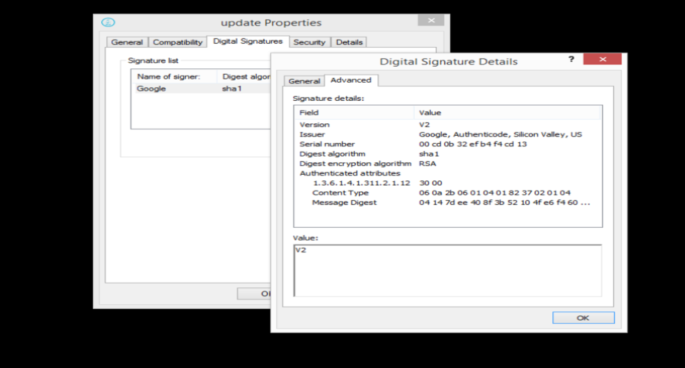
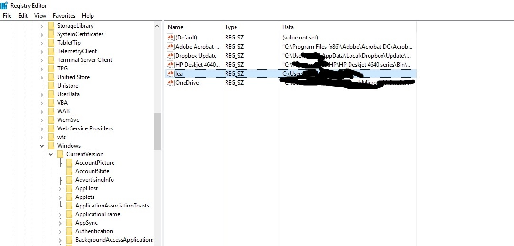
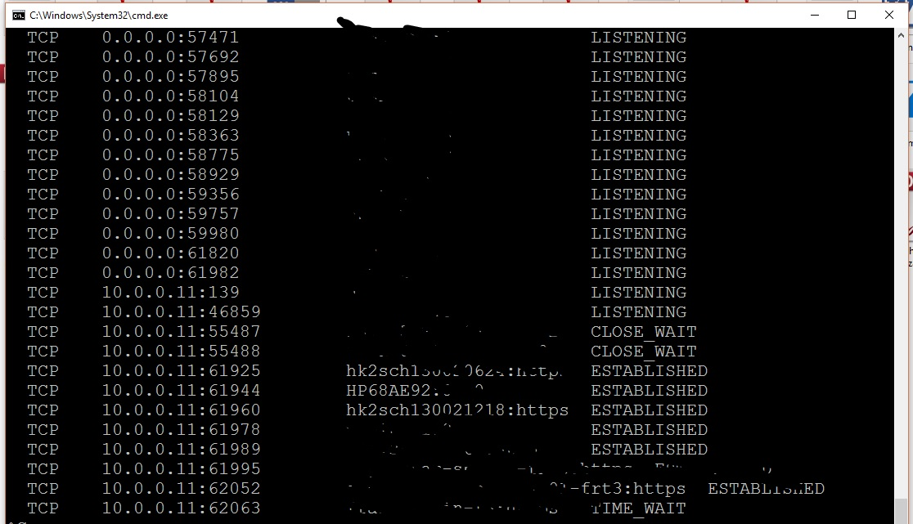
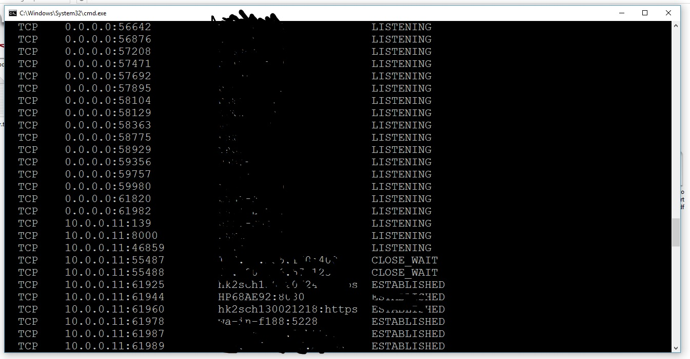
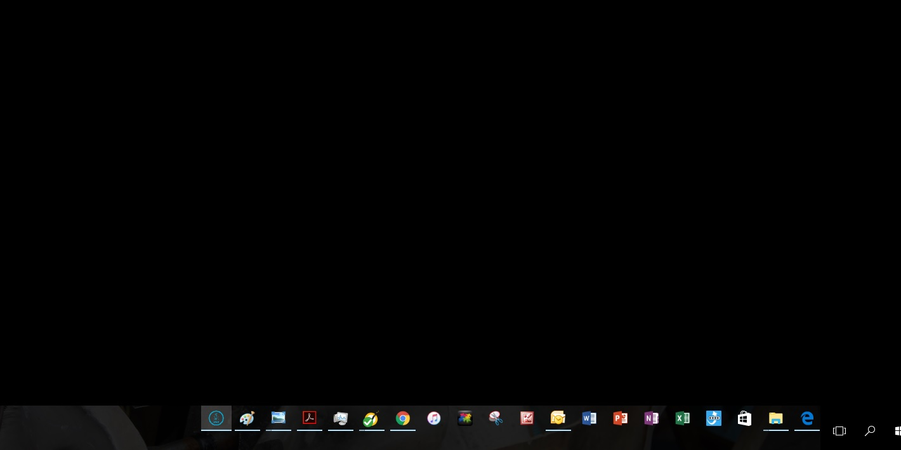

# lea
lea is a cute backdoor, it looks for available networks, including printers
and all internet connected devices, enter it self to the registry under:"SOFTWARE\\Microsoft\\Windows\\CurrentVersion\\Run"
as to run on system start-up, opens up port-8000 & listen for incoming command to execute as admin.
lea is a google software and as such it has its own digital signiture, with sha-1 on RSA.
lea passes the newest norton anti-virus scan, and doesn't ask for permission to open up ports
and to register at the windows current config. 
download lea, she's the best!

..

       Tested on:
       DOCID: v118291851_NortonM_Retail_1_en_us
       Operating System: Windows, Mac OS X, Android, iOS
       Last modified: 05/11/2017
       WINDOWS 10 HOME 2016 10.0*
       HP Pavilion Desktop - 510-p020
       Intel® Core™ i5-4460S Processor

<table>
<tr>
       <th>Author's</th>
       <td><a href="https://sarin.io">Numéro du projet sept sérine</a> (<a href="http://sp7.co">@Sp7</a>)</td>
    </tr>
    <tr>
        <th>Copyright</th>
        <td>2017-2020 The-Sarin-project</td>
    </tr>
    <tr>
        <th>Version</th>
        <td>0.0.0</td>
    </tr>
</table>

# description
       23/5/2017- we downloaded the latests Symantec-norton at nr.tn/2qeLkiE
       at first the anti-virus didnt want to activate the software but after getting 
       the software signed, and downloaded about a- thousand times 
       (by norton-users dha..)
       then the software passed the norton scanner.

after running the software (not as admin or anything),
we got a backdoor operating on 

<a href="https://sp7.co/hacks">website<a>
